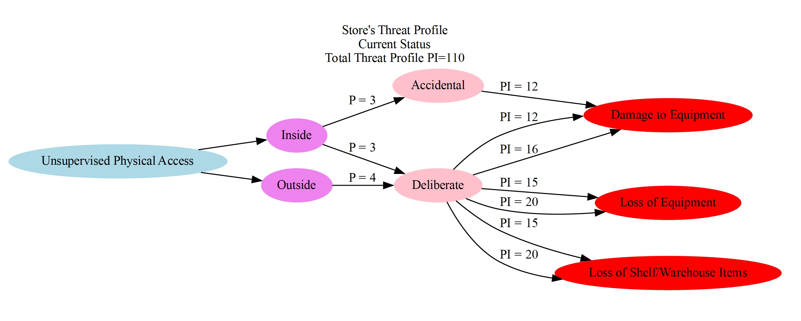

<h1 align="center" > Threat Profile </h3>

<p align="center"> 

This application was designed to support the process of generating threat profiles according to the OCTAVE-S risk assessment framework (Alberts & Dorofee, n.d; Alberts et al., 2005). After developing a risk analysis report, Cathy, the manager of the "Pampered Pets" store, was not convinced by the risk analysis report that compared the risk assessment of the status quo of her store to the one after digitalization. So there was a need for a visualization tool that would help her decide. A Graphviz library, an open-source graph visualization library (The Graphviz Authors, n.d), was used to generate threat profiles using directed graphs. A qualitative assessment will also be possible using this application that generates a PI (Probability-Impact) score for each threat profile and a total PI score for the whole scenario. This number is valuable for comparison and decision-making. It was developed with the help of a risk assessment matrix (P. M. Training, 2022).
</p>

## Table of Contents
- [Table of Contents](#table-of-contents)
- [About](#about)
- [Getting Started](#getting-started)
  - [Prerequisites](#prerequisites)
  - [Downloading the code and setting up the virtual environment](#downloading-the-code-and-setting-up-the-virtual-environment)
  - [Running the script](#running-the-script)
- [Application instructions](#application-instructions)
  - [Threat Profile Example](#threat-profile-example)
  - [JSON file structure](#json-file-structure)
  - [Comparison of the Threat Profiles and PI scores](#comparison-of-the-threat-profiles-and-pi-scores)
- [Built Using](#built-using)
- [Author](#author)
- [License MIT](#license-mit)
- [References](#references)

## About

The application accepts JSON file that contains threat properties according to the OCTAVE-S framework (Alberts & Dorofee, n.d). Each JSON file could contain information about several threats to several assets in one scenario. The data that needs to be supplied in the JSON file has Assets, Access (Optional), Actors, Motives (Optional), and Outcomes, along with probability and impact scores. The software will then generate threat profiles and calculate a PI score for each threat profile and a total PI score for the scenario to allow comparison.

## Getting Started

The following instructions will guide you on how to run this python script.

### Prerequisites

Python 3 is needed to run this project.

If you don't have python installed on your computer, follow this link to install it [python](https://www.python.org).

You can check if you have python 3 installed by running the following command on the terminal (macOS) or command prompt (Windows)

```
python --version
```
Example output:

```
Python 3.11.1
```

### Downloading the code and setting up the virtual environment

- Download the project folder [Threat-Profile](https://github.com/drmohammadatieh/Threat-Profile/archive/refs/heads/main.zip)

- Open the terminal on macOS or the command prompt on Windows 7/10.
- Go to the directory that contains the project files. Example:
  
  In macOS:
  
  ```
  cd  Downloads/Threat-Profile-main/
  ```
  In Windows:

   ```
  cd  Downloads\Threat-Profile-main\
  ```
- Create a virtual environment:

```
python-m venv .venv
```
Activate the virtual environment

```
source .venv/bin/activate
```

Install dependencies:

```
pip install -r requirements.txt
```

### Running the script

Run the script

  ```
  python threat_profile.py
  ```

## Application instructions

The application will process the JSON files in the 'data' folder, generate threat profiles and PI (Probability-Impact)  scores, and export them to the 'output' folder. The 'output' folder will contain other folders with the projects’ names. Each project folder will contain other folders with the analyzed scenarios' names.

Each output for each analysis is composed of different threat profiles, and a 'PI Score.txt' file will contain the PI score of each threat profile in addition to the total PI score for the scenario.


  
### Threat Profile Example

An example of a threat profile generated by the application is shown below:



The first category on the left is "Access". The Next one is the "Actors", followed by the "Motives", and then the outcomes. The first number group on the left represents the probability. Probability is calculated by the probability of the actor, or the probability of the actor added to the probability of the motive. The second number group on the right represents the PI scores. The PI score is the product of probability (probability of the actor/ the actor & motive) multiplied by the impact of the outcome. The total PI score for the threat profile is shown on the third line of the title. Colour Coding of the Outcomes

The outcome will be colour-coded according to the highest PI score. For example, all the outcomes shown in the example above were red because the highest PI score for each outcome was extreme. Please note that each outcome might have more than a PI score due to different threat routes. Another example shown below shows different colours. The colour scale according to the PI score is as follows (P. M. Training, 2022):

- 1 - 2	Negligible risk	Gray.
- 3 - 4	Low-risk	Green.
- 5 - 9	Medium risk	Yellow.
- 10 - 14	High-risk	Orange.
- 15 - 25	Extreme Risk	Red.


### JSON file structure

  A JSON file structure is shown below followed by a description.


  The JSON file contains the following main key-vale pairs:
  -	**Project**, for the project name ("Pampered Pets" in the sample data)
  -	**Analysis**, for the analysis name ("Current Status" and "Digitalised" in the sample data).
  -	**Assets** for an array of threat profile properties. Each Asset contains the following key-value pairs:
  -	**Name**, for the asset name.
  -	**Access**, for the access. For example, network access or physical access.
  -	**Actors**, for the actors. For example, inside or outside actors. Each one has a **Probability** attribute that will be used for calculating the PI score.
  -	**Motives**, for the motives. For example, accidental or deliberate. Each one has a **Probability** attribute as well.
  -	**Outcomes**, for the possible outcomes. Each has an **Impact** attribute that will be used for the **PI score** calculation.
  -	**Impossible** for an array of the impossible actor-motive and actor-motive-outcome combinations in array format that will be excluded from the processing. For example, ["Outside", "Accidental"] means that the application will not connect an outside actor to an accidental motive during the threat profile generation process and **PI score** calculation.

### Comparison of the Threat Profiles and PI scores

PI scores of different scenarios can be compared by simply opening the output folders and viewing each analysis's 'PI score.txt'. The file name will contain the analysis's name for easier comparison.


  

## Built Using

- [Python 3.11.1](https://www.python.org) - Interpreted programming language.
- [Graphviz](https://graphviz.org) - An open-source graph visualization software.

## Author

- [@drmohammadatieh](https://github.com/drmohammadatieh)
  
## License [MIT](https://github.com/drmohammadatieh/Follow-Up-Schedule/blob/master/LICENSE)

## References

Alberts, C. & Dorofee, A. (n.d) OCTAVE SM Threat Profiles. Available from: http://130.18.86.27/faculty/warkentin/SecurityPapers/Merrill/AlbertsDorofee_OCTAVEThreatProfiles.pdf [Accessed 27 November 2022].

Alberts, C., Dorofee, A. & Stevens, J. (2005) OCTAVE ® -S Implementation Guide, Version 1.0. Available from: https://resources.sei.cmu.edu/asset_files/Handbook/2005_002_001_14273.pdf [Accessed 27 November 2022].

P. M. Training (2022) Simple Risk Assessment Matrix Template & Excel Example. Available from: https://pm-training.net/risk-assessment-matrix/ [Accessed 28 November 2022].

The Graphviz Authors (n.d) Graphviz. Available from: https://graphviz.org [Accessed 18 December 2022].


